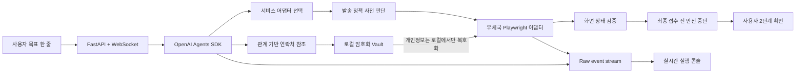

# 딱한줄 (Ddak One Line)

> 사람과 물건을 한 줄로 말하면, 발송 위험을 먼저 판단하고 우체국 접수 직전까지 준비하는 실행형 AI 에이전트

딱한줄은 디지털 서비스 이용이 어려운 고령자와 느린학습자를 위한 Agent24 해커톤 프로토타입입니다. 사용자는 사이트 메뉴와 입력 순서를 익히는 대신 `큰딸에게 사과를 소포로 부치고 싶어`처럼 목표만 말합니다. 에이전트는 배송 경로와 물품 위험을 판단하고, 로컬 개인정보 Vault의 참조값을 사용해 실제 인터넷우체국 화면을 조작합니다.

이 저장소는 심사용 코드와 Pipeline Architecture 재현 자료를 제공합니다. 별도의 운영 서비스나 공개 데모 URL은 제공하지 않습니다.

## 핵심 파이프라인



처리 순서는 다음과 같습니다.

1. `select_service_adapter`가 목표를 등록된 우편 어댑터와 대조합니다.
2. `resolve_household_contact`가 관계 표현을 개인정보 원문이 아닌 `contact_ref`로 바꿉니다.
3. `assess_shipment_policy`가 목적지와 물품을 브라우저 실행 전에 판정합니다.
4. `stage_postal_parcel`이 로컬 Vault에서 필요한 값을 꺼내 Playwright 어댑터에 전달합니다.
5. `verify_epost_stage`가 입력 결과와 현재 화면을 검증합니다.
6. 에이전트는 `접수신청` 직전에 멈추고 사용자 확인 화면으로 제어권을 넘깁니다.

## 평가 근거가 되는 구현

| 구성 | 역할 | 파일 |
|---|---|---|
| Agent orchestration | 도구 호출 순서, 스트리밍 실행, 사용량 계측 | `app/agent.py` |
| Tool boundary | 어댑터 선택, 연락처 참조, 정책 판정, 실행, 검증 | `app/tools.py` |
| Adapter layer | 사이트별 실행을 공통 인터페이스와 registry로 격리 | `app/adapters/` |
| Shipping intelligence | 국내·EMS 분기와 위험 물품 사전 차단 | `app/shipping_policy.py`, `app/shipping_rules.json` |
| Privacy Vault | 연락처 payload를 Fernet으로 암호화해 로컬 SQLite에 저장 | `app/vault.py` |
| Safety boundary | 최종 제출 차단과 명시적 수동 인계 | `app/adapters/epost.py`, `web/handoff.html` |
| Observability | 제품 이벤트와 Raw Responses API 이벤트 분리 | `app/events.py`, `app/main.py` |
| Cost guard | 실행별 토큰 비용 집계와 hard stop | `app/budget.py` |
| Verification | 정책, Vault 비노출, UI 계약, 중단 경계 테스트 | `tests/test_core.py` |

## 현재 데모 범위

- 우체국 창구소포 간편사전접수 비회원 국내소포 경로
- 국내 주소는 국내소포, 해외 주소는 EMS로 라우팅
- 생과일 등 위험 물품을 브라우저 실행 전에 차단
- 실제 인터넷우체국 입력 화면을 500ms 주기로 스트리밍
- 스크린샷 폴링 실패 시 CDP JPEG screencast로 전환
- 최종 `접수신청` 자동 클릭 금지
- 수동 인계 화면에서 사용자가 접수 여부를 직접 결정

세부 시나리오는 [`AGENT24_SHIPPING_INTELLIGENCE_SCENARIOS.md`](./AGENT24_SHIPPING_INTELLIGENCE_SCENARIOS.md)에 정리했습니다.

## 로컬 실행

### 1. 준비

- Python 3.12+
- [uv](https://docs.astral.sh/uv/)
- OpenAI API key

```powershell
uv sync
uv run playwright install chromium
Copy-Item .env.example .env.local
```

`.env.local`의 `OPENAI_API_KEY`에 개인 키를 입력합니다. 이 파일은 Git에서 제외됩니다.

### 2. 실행

```powershell
uv run python -m app.main
```

- 제품 화면: <http://127.0.0.1:8000/>
- 실행 콘솔: <http://127.0.0.1:8000/console>
- Raw event stream: <http://127.0.0.1:8000/raw>
- 상태 확인: <http://127.0.0.1:8000/health>

### 3. 테스트

```powershell
uv run pytest
```

테스트는 실제 접수를 만들지 않으며, 임시 Vault와 simulated adapter를 사용해 핵심 파이프라인 및 안전 경계를 검증합니다.

## 개인정보와 안전 원칙

- API key, `.env.local`, 로컬 DB, Vault 암호화 키, 실행 로그와 녹화물은 저장소에 포함하지 않습니다.
- 모델에는 이름·주소·전화번호 원문 대신 관계와 `contact_ref`만 전달합니다.
- 저장소의 연락처는 프로토타입 동작을 위한 비실사용 데모 fixture입니다.
- 에이전트는 사용자가 말하지 않은 무게·크기·결제수단을 임의로 결정하지 않습니다.
- 실제 접수는 자동 완료되지 않습니다. 사용자의 명시적 확인이 마지막 단계에 필요합니다.

## 한계

- 인터넷우체국 DOM 변경에 따라 Playwright selector 보정이 필요할 수 있습니다.
- 현재 구현은 우체국 국내소포 중심의 해커톤 프로토타입입니다.
- EMS는 정책 분기와 입력 재개 흐름을 포함하지만 운영 수준의 전 국가 규정 엔진은 아닙니다.
- 공개 서버 배포와 장기 운영을 전제로 하지 않습니다.
